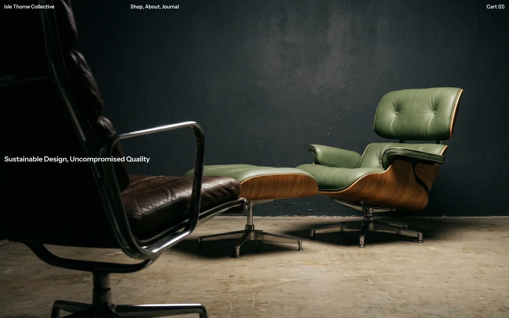

# Isle Thorne Collective

A free furniture shop template for [Astro](https://astro.build), with content collections and [Tailwind CSS](https://tailwindcss.com): a home page, the shop with every collection, product pages, a cart, an about page and a journal. Designed by [Elena Smirnova](https://tympanus.net/codrops/author/elenasmirnova/) for [Codrops](https://tympanus.net/codrops/).



It's a static site: no UI framework, no CMS, no backend. The content is Markdown and JSON in the repository, the cart lives in the browser, and checkout and the newsletter form are demos you can connect to real services (see [Going further](#going-further)). In the browser, [Lenis](https://lenis.darkroom.engineering) does the smooth scrolling and [Embla Carousel](https://www.embla-carousel.com) the home page's rows, and links between pages play a page transition, made with [Interlude](https://github.com/codrops/interlude) and [GSAP](https://gsap.com) (see [Page transitions](#page-transitions)).

## What it is, and what it isn't

- **A front-end storefront.** The design, pages and interactions of a small furniture shop, ready for you to restyle and fill with your own products.
- **Not a complete shop.** The cart works in the browser, but there's no checkout, accounts, stock or payments, and the newsletter form sends nothing until you connect a provider. [Going further](#going-further) explains how to add each.
- **Stand-in content.** The photos are AI-generated, and the studio, its products, collaborators and press are invented. Replace them with your own.
- **Needs** Node 22.12 or newer. Pages and links work without JavaScript; the cart, the phone menu, the newsletter form and the product slideshow need it.

## Quick start

```sh
npm create astro@latest -- --template codrops/isle-thorne-collective
cd isle-thorne-collective
npm run dev
```

Then open `http://localhost:4321`. Node 22.12 or newer.

| Command                | Action                                                    |
| :--------------------- | :-------------------------------------------------------- |
| `npm run dev`          | Start the dev server at `localhost:4321`                  |
| `npm run build`        | Check the types, then build the site to `dist/`           |
| `npm run preview`      | Serve the build locally                                   |
| `npm run check`        | Type-check (`astro check`)                                |
| `npm run format`       | Format everything with Prettier (Tailwind classes sorted) |
| `npm run format:check` | Check the formatting                                      |

On GitHub, every push checks the formatting and runs the build, types included (`.github/workflows/ci.yml`).

## Make it yours

- **Name, navigation, footer, shipping text, currency, newsletter:** `src/config/site.ts`. Prices are whole numbers; how they're written ("23,000 kr.") is `currency.format`, with an example for other currencies.
- **Your domain:** `site` in `astro.config.mjs` (canonical links, Open Graph images, the sitemap).
- **Colours and type sizes:** the `@theme` block at the top of `src/styles/global.css`.
- **Font:** `fonts` in `astro.config.mjs` (Instrument Sans, self-hosted from its Fontsource package). Install another Fontsource package and point `src` at its files.
- **The about page:** `src/data/about.ts`.
- **Products, collections and stories:** see [Content](#content).
- **Photos:** `src/assets/` (`home/` for the home page's two large photos, `products/`, `journal/`).
- **Page transitions:** see [Page transitions](#page-transitions).

## Content

Everything the shop shows is in `src/content/`, typed by `src/content.config.ts`:

- **Collections** (`collections.json`): the furniture lines, in display order, with their materials and the text of the product pages' "Process" panel.
- **Products** (`products/*.md`): one file per product. The front matter holds its collection, model number, materials, size, price and photos (the first is the main one; a product can have any number, and with just one the page shows it without the slideshow); the body is its description. The file name is its URL: `elysian-lounge-seat-no-7.md` is `/shop/elysian-lounge-seat-no-7/`. Piece counts are counted from these files.
- **Journal** (`journal/*.md`): one file per story, with its credits, date and cover photo. A `>` quote in the text is shown large.

Photos are referenced from the front matter by a relative path; Astro resizes them and serves WebP at the sizes each page needs.

To add a product, copy a file in `src/content/products/`, rename it, change its facts and point its `images` at your photos. It shows up in its collection on the home page, in the shop and in the cart.

### Start from empty

1. Delete the files in `src/content/products/` and `src/content/journal/`, and the photos in `src/assets/products/` and `src/assets/journal/`.
2. Replace the collections in `src/content/collections.json` with your own (at least one).
3. Add your products and stories, and replace the two photos in `src/assets/home/`.
4. Run `npm run check`: the content schema tells you if something is missing or misspelled.

A collection with no products isn't shown, so you can fill them in one at a time. A home page row loops when its photos are wider than the screen; with fewer, it simply drags.

## Going further

The template stays static on purpose. When you need more:

- **A CMS.** Pages read the content through `src/lib/shop.ts` and `src/lib/journal.ts`, never directly. To manage it in a CMS (Sanity, Contentful, Storyblok…), give the collections in `src/content.config.ts` a [loader](https://docs.astro.build/en/guides/content-collections/) for it instead of the Markdown files; the pages stay the same.
- **A real newsletter.** Most email providers (Buttondown, Mailchimp, Kit…) give you a form address that accepts a plain HTML form. Set it as `newsletter.action` in `src/config/site.ts`, with the field name they expect as `newsletter.field`. The form then sends there, in a new tab.
- **Real checkout.** The simplest way is a payment link per product (Stripe Payment Links, for example): add a `checkout` URL to the products' schema and point the cart's Checkout button at it. A cart that takes several products to one payment needs a commerce service (Snipcart, Shopify's Storefront API…).

## Page transitions

Links between pages don't load a new page: Astro's client router (`<ClientRouter />`) fetches it and swaps it in, and [Interlude](https://github.com/codrops/interlude) covers the old page and reveals the new one with a transition, animated with GSAP. All 21 of Interlude's transitions are included, one file each in `src/transitions/`, so you can try them on the site and keep the ones you like, plus one of the site's own, `loading-curtain`, the default.

- **Choosing:** links play `defaultTransition` from `src/interlude.config.ts`: `loading-curtain`, Interlude's `curtain` with the design's loading screen as its panel. A black screen rises from the bottom over the page with the site's name, tagline and founding year across the middle (from `src/config/site.ts`), stays while the next page loads, then rises off the top to show it, the page drifting up with it (top to bottom going back). Its timings are at the top of `src/transitions/loading-curtain.ts`. To keep the screen up a minimum time between pages, set `minCoverTime` (ms; 0 by default) in `src/interlude.config.ts`. To try another transition everywhere, change `defaultTransition`. A link, or any element around links, can name its own: `<a href="/about/" data-transition="velvet">`, or `data-transition="none"` to swap without one. Back and forward replay the transition each page was reached with.
- **The first visit** opens with the same screen (`revealOnLoad` in `src/interlude.config.ts`): the first page is covered until its fonts and the images at the top are ready, and at least 0.4 s, then the screen rises. A first visit shows the page a little later; set `revealOnLoad: false` to show it straight away.
- **Removing the others:** delete their files from `src/transitions/`, keeping the default one. Without the WebGL ones (`channel`, `dissolve`, `dither`, `ink`, `particles`, `spiral`, `velvet`), also delete `src/lib/interlude/webgl.ts`, the `three` and `@types/three` packages, and the `build` and `optimizeDeps` lines under `vite` in `astro.config.mjs`. Keep `src/lib/interlude/old-page.ts`: `loading-curtain` uses it to move the whole page.
- **Tuning:** each transition's timings, eases and look are settings at the top of its file. The colours are in `src/styles/global.css`: the cover is black (`--interlude-color`), and the transitions with colour of their own take the site's red (`--red` and `--color-accent`: `velvet`, `ink`, `frame`, `corner`, `spiral`'s glow, `dissolve`'s rim, `particles`, the loader). `particles` spells "Isle Thorne", `typewriter` types the tagline, and `carousel` makes a card for each page in the header.
- **The loader** (`src/components/Loader.astro`): a small spinner at the pointer while the next page loads, for the transitions that wait for it before showing it, and only after 300 ms.
- **Weight:** Astro's client router, Interlude, GSAP and the default transition add about 39 kB (compressed) to the JavaScript each page loads. Other transitions are downloaded when a link that uses one is pointed at or focused, and three.js (about 235 kB) only for the WebGL ones.
- **Scripts:** with the client router, the pages' scripts run once per visit, not on every page. What sets up a page (the rows, the product photos, the cart, the menu, the newsletter form) is in `src/scripts/pages/`, where `onPage()` runs it for each page shown. It looks for the page's elements in the page's `<main>` (or, outside it, with `pageElements()` from `src/scripts/page-elements.ts`), never in the whole document: during some transitions, a still copy of the old page is on screen, with the same classes. The cart, the menu and the newsletter form close when a transition starts: as modal dialogs, they'd show above it. Elements fixed to the screen, like the product page's bar, go in the layout's `fixed` slot (`<Fragment slot="fixed">`), outside `<main>`: transitions move `<main>`, and a fixed element inside it would move with it.
- **Your own transitions:** see [Writing a transition](https://github.com/codrops/interlude#writing-a-transition) in Interlude's README.

## How it's built

- **Pages** (`src/pages/`): `index`, `shop/index` and `shop/[slug]` (a page per product), `about`, `journal/index` and `journal/[slug]`, and `404`. All use `src/layouts/BaseLayout.astro`, which picks the page's ground and the header's and footer's colours.
- **Styles**: Tailwind classes in the components. The design's tokens and a few utilities are in `src/styles/global.css`: `grid-site` (2 columns on phones, 12 from 1024px, 12px apart, so labels line up across the page), `card` (the rounded panels, 4px from the edges and from each other) and `scroll-row` (rows of photos that scroll sideways). The styles are inlined in each page (about 5 KB compressed), so they don't delay the first paint.
- **Font**: self-hosted through Astro's Fonts API, with a metric-matched fallback so text doesn't shift when it loads.
- **The cart** (`src/lib/cart.ts`, `src/scripts/cart.ts`, `src/components/Cart.astro`): product ids and quantities in `localStorage`, shown in a `<dialog>`. Each page carries a small catalogue (names, prices, thumbnails), so the cart always matches the content.
- **The newsletter form** (`src/components/Newsletter.astro`): a `<dialog>` opened from the footer.
- **Smooth scrolling** (`src/scripts/smooth-scroll.ts`): Lenis, so mouse wheels and trackpads glide; touch scrolling stays native. It's off with reduced motion, and still while the cart, the menu or the newsletter form is open, and during page transitions. Anything that scrolls on its own (the cart, the product panels) has `data-lenis-prevent`. To scroll natively, remove its `<script>` from the layout.
- **The home page's rows** (`src/components/ProductRow.astro`, `src/scripts/carousel.ts`): endless rows dragged by mouse, finger or trackpad, with momentum, built on Embla Carousel and its wheel plugin. A throw glides on and stays where it lands (`dragFree`; set it to `false` to snap a photo to the left edge). A drag never opens a product, a click does, and vertical swipes still scroll the page. Without JavaScript, the rows scroll sideways natively.
- **The product photos** (`src/components/ProductGallery.astro`): stacked on phones; from 1024px, a slideshow. The big photo is split into two invisible halves, the previous and next buttons, each showing its arrow when hovered or focused; it wraps around, and the ← and → keys work too. The small pictures beside it show every photo, the current one dimmed, and clicking one shows it big.
- **The product page's panels** (Description, Measurements, Process, Shipping) are `<details>` elements sharing a `name`, so the browser opens one at a time without JavaScript.
- **The phone menu** is a `<dialog>` too: focus stays inside it, and Escape closes it.
- **Navigation** goes through Astro's client router, with a page transition (see [Page transitions](#page-transitions)). Pages are prefetched on hover, so the next one is often ready before the transition has covered the screen.
- **SEO**: titles, descriptions, canonical URLs, Open Graph images, a sitemap, and structured data for products and stories (`src/components/Seo.astro`).

## Accessibility

Landmarks and a skip link, one `h1` per page, visible focus everywhere, controls at least 24px tall to the touch, alt text on every product photo, names for icon buttons, announcements in the cart ("added", "removed"), and no sideways scrolling at 390px.

During a page transition the page can't be clicked, focused or scrolled. Then focus moves to the new page's content, and Astro announces its title to screen readers. With reduced motion, pages swap without a transition. Without JavaScript, links are plain page loads.

## Deploy

`npm run build` writes a static site to `dist/`: any static host serves it (Netlify, Vercel, Cloudflare Pages, GitHub Pages…). Set your domain in `astro.config.mjs` first.

## Credits

- Design: [Elena Smirnova](https://tympanus.net/codrops/author/elenasmirnova/), for [Codrops](https://tympanus.net/codrops/).
- Font: [Instrument Sans](https://fonts.google.com/specimen/Instrument+Sans), under the SIL Open Font License.
- Page transitions: [Interlude](https://github.com/codrops/interlude), by Codrops, with [GSAP](https://gsap.com) and [three.js](https://threejs.org). Some of its transitions are inspired by other sites: `peel` by the page turn on [eminente.art](https://eminente.art/), `stack` by the project pages on [Olga Prudka's site](https://olgaprudka.com/), `frame` by the page transition on [Benoît Marzouvanlian's site](https://www.benmarzouvanlian.com/), `corner` by [a post by Oli](https://x.com/olvhrs/status/1899756396897333632) on X, and `typewriter` by the type animation of The Manifest, by Studio Freight, shared by [Lídia Santos](https://www.linkedin.com/posts/inventorylidia_too-often-in-the-creative-world-we-see-the-activity-7431778963980443648-jglF).
- Photos: generated for this template with AI (Google's Nano Banana model, in [Paper](https://paper.design)). They're stand-ins: replace them with your own. The studio, its products, collaborators and press are invented.

## License

[MIT](LICENSE): use it for anything, personal or commercial.
